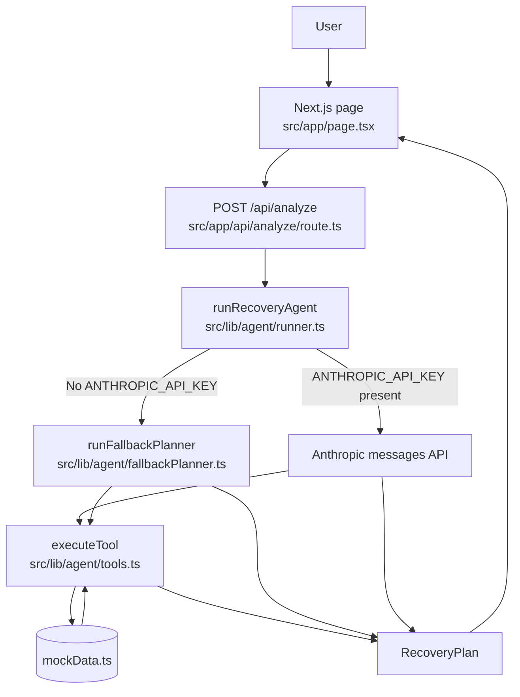
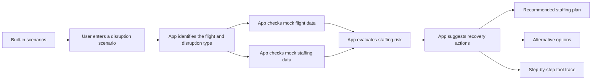
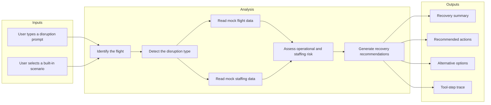
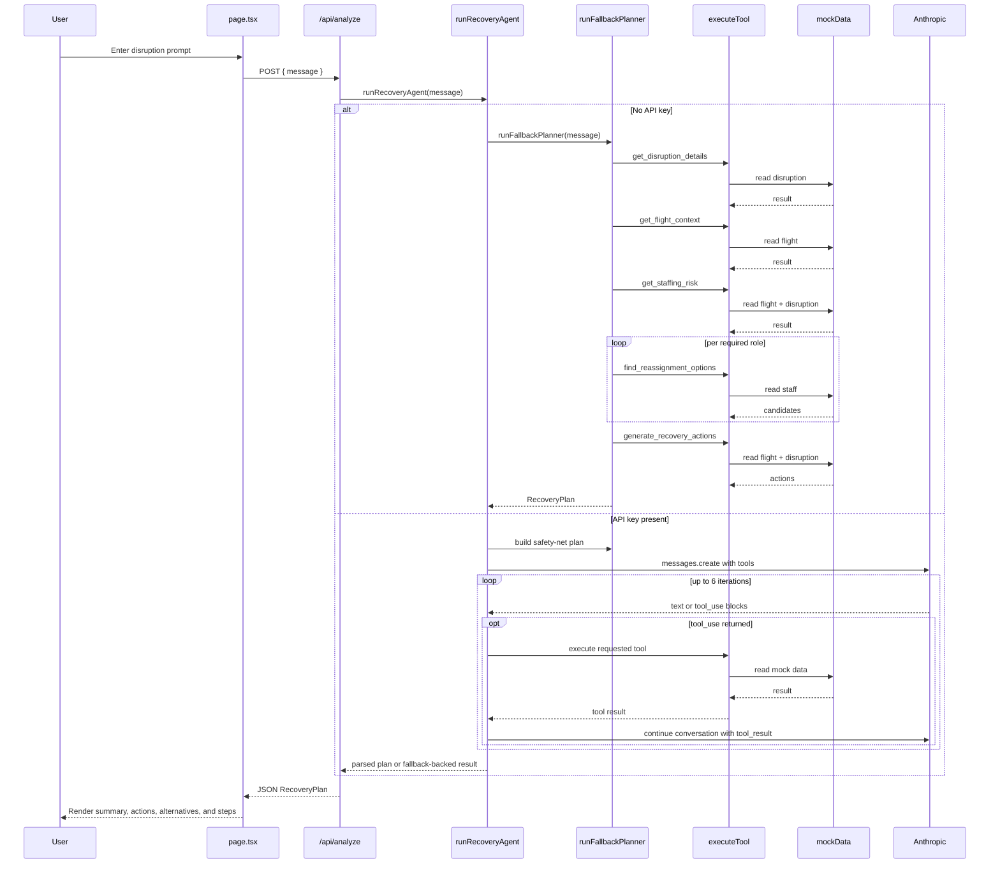

# IROP Agent Prototype

A standalone Next.js prototype for an airport irregular operations recovery copilot focused on airport staffing decisions.

## What This Application Is

This app is a small, self-contained demo that accepts a disruption prompt such as a delay, cancellation, gate change, or late inbound aircraft event and returns a recovery plan.

The prototype has two execution modes:

- `fallback-planner`: deterministic logic built entirely on local mock data
- `anthropic-agent`: Anthropic tool-calling loop, enabled only when `ANTHROPIC_API_KEY` is set

In both cases, the system is constrained to mock flights, disruptions, and staff records defined in code.

## Stack

- Next.js 14 App Router
- React 18
- TypeScript
- Tailwind CSS
- Anthropic SDK for optional tool-calling

## How It Works

The app has one UI page and one API route:

- [`src/app/page.tsx`](/abs/path/c:/Users/12735/Projects/irop-agent-prototype/irop-agent-prototype/src/app/page.tsx) renders the textarea, scenario shortcuts, loading/error states, and the structured recovery output
- [`src/app/api/analyze/route.ts`](/abs/path/c:/Users/12735/Projects/irop-agent-prototype/irop-agent-prototype/src/app/api/analyze/route.ts) accepts `POST { message }` and delegates all analysis to the agent runner

The backend logic is split into three parts:

- [`src/lib/agent/runner.ts`](/abs/path/c:/Users/12735/Projects/irop-agent-prototype/irop-agent-prototype/src/lib/agent/runner.ts): decides whether to use Anthropic or fallback logic
- [`src/lib/agent/tools.ts`](/abs/path/c:/Users/12735/Projects/irop-agent-prototype/irop-agent-prototype/src/lib/agent/tools.ts): defines tool schemas and executes all tool lookups/actions against mock data
- [`src/lib/agent/fallbackPlanner.ts`](/abs/path/c:/Users/12735/Projects/irop-agent-prototype/irop-agent-prototype/src/lib/agent/fallbackPlanner.ts): runs the deterministic planning flow when no API key is present

All stateful business data lives in memory:

- [`src/lib/data/mockData.ts`](/abs/path/c:/Users/12735/Projects/irop-agent-prototype/irop-agent-prototype/src/lib/data/mockData.ts)
- [`src/lib/types/index.ts`](/abs/path/c:/Users/12735/Projects/irop-agent-prototype/irop-agent-prototype/src/lib/types/index.ts)

## End-To-End Request Flow

1. The user types a disruption prompt or clicks a built-in scenario card.
2. The browser sends `POST /api/analyze` with `{ "message": "..." }`.
3. The API route validates that `message` is a string.
4. `runRecoveryAgent(message)` is called.
5. If `ANTHROPIC_API_KEY` is missing, the deterministic fallback planner runs.
6. If the key exists, the Anthropic loop is started with tool definitions.
7. Tool calls are executed against local mock data only.
8. A `RecoveryPlan` object is returned to the page and rendered.

## Detailed Behavior Analysis

### Frontend

The UI is intentionally simple:

- single textarea input
- one primary submit action
- one reset action
- built-in scenario cards that only prefill the textarea
- result cards for summary, impact window, staffing risk, actions, alternatives, and tool steps

The frontend does not perform domain analysis. It is only a thin client over `/api/analyze`.

### API Layer

The API route is minimal:

- validates `message`
- returns `400` on bad input
- returns `500` with an error string for unexpected failures
- does not authenticate, rate-limit, or persist requests

### Agent Runner

`runRecoveryAgent()` uses a strict branch:

- no API key: return `runFallbackPlanner(message)`
- API key present: call Anthropic with tool schemas, execute returned tool calls, and try to parse the model response into a `RecoveryPlan`

Important implementation detail:

- even in Anthropic mode, the runner also computes a fallback plan up front and uses it as a safety net if JSON parsing fails or the model does not return a valid shape

### Deterministic Planner

The fallback planner is the most reliable description of current business behavior:

- extracts the first `PD###` flight number from the message
- defaults to `PD123` if none is found
- fetches disruption details
- fetches flight context
- computes staffing risk
- asks for reassignment options for each required role on that flight
- generates canned recovery actions from disruption type
- returns a normalized `RecoveryPlan`

This means the prototype is not doing open-ended reasoning over arbitrary airport states. It is assembling a structured answer from a fixed sequence of local functions.

### Tooling Model

The tool layer exposes five tools:

- `get_disruption_details`
- `get_flight_context`
- `get_staffing_risk`
- `find_reassignment_options`
- `generate_recovery_actions`

These tools are not side-effecting. They only read mock data and construct derived output.

### Mock Data Model

The prototype includes:

- 3 flights
- 4 disruptions
- 8 staff members

The decision space is narrow by design. This is a demo of orchestration structure, not a realistic operations optimizer.

## Current Logic Constraints And Risks

These are the main behavior limits in the current implementation:

- The app is entirely mock-data driven. Anything outside the hardcoded dataset will fail.
- Flight extraction is regex-based and defaults to `PD123`, so prompts without a recognizable flight number can produce misleading plans.
- `getDisruptionForFlight()` returns the first matching disruption for a flight. Because `PD123` has both `delay` and `late_inbound` disruptions, the later `late_inbound` scenario is effectively unreachable in current logic.
- Staffing feasibility is simplified to role match, reserve preference, and weekly hours cap. Shift overlap, location, exact qualification coverage, and task timing are not modeled.
- `generate_recovery_actions()` is template-driven, so recommendations are scenario-shaped rather than dynamically optimized.
- The UI displays tool-step summaries only; there is no trace viewer, audit log, or raw payload inspector.
- The Anthropic path uses a fixed model string and no streaming.
- There is no persistence, auth, multi-user support, or database layer.

## Architecture Diagram

The Mermaid source below is also available as a standalone file at [`docs/architecture.mmd`](/abs/path/c:/Users/12735/Projects/irop-agent-prototype/irop-agent-prototype/docs/architecture.mmd).



## User-Friendly App Overview Diagram

This version is intended for non-technical readers who want to understand what the app does at a glance. The Mermaid source is also available at [`docs/app-overview.mmd`](/abs/path/c:/Users/12735/Projects/irop-agent-prototype/irop-agent-prototype/docs/app-overview.mmd).



## Presentation-Style Functionality Diagram

This version groups the app into `Inputs`, `Analysis`, and `Outputs` so it is easier to use in documentation or slides. The Mermaid source is also available at [`docs/app-functionality.mmd`](/abs/path/c:/Users/12735/Projects/irop-agent-prototype/irop-agent-prototype/docs/app-functionality.mmd).



## Sequence Diagram

The Mermaid source below is also available as a standalone file at [`docs/request-sequence.mmd`](/abs/path/c:/Users/12735/Projects/irop-agent-prototype/irop-agent-prototype/docs/request-sequence.mmd).



## Run Locally

```bash
npm install
npm run dev
```

Open `http://localhost:3000`.

If you want Anthropic tool-calling:

```bash
set ANTHROPIC_API_KEY=your_key_here
npm run dev
```

## Render The Mermaid Files

If you want diagrams outside GitHub/Markdown preview, use Mermaid CLI:

```bash
npm install -g @mermaid-js/mermaid-cli
mmdc -i docs/architecture.mmd -o docs/architecture.svg
mmdc -i docs/app-overview.mmd -o docs/app-overview.svg
mmdc -i docs/app-functionality.mmd -o docs/app-functionality.svg
mmdc -i docs/request-sequence.mmd -o docs/request-sequence.svg
```

## Example Prompts

- `PD123 is delayed 95 minutes. What should we do?`
- `How should we handle the cancellation of PD67?`
- `Gate changed for PD010 from A2 to A5. Give me a staffing plan.`
- `A late inbound aircraft will push PD123 back by 70 minutes. Minimize overtime.`

## Verification Status

I was able to analyze the full application from source.

I could not run `npm run build` in this environment because neither `node` nor `npm` is available on the current shell `PATH`, so runtime verification is still needed on a machine with Node.js installed.
